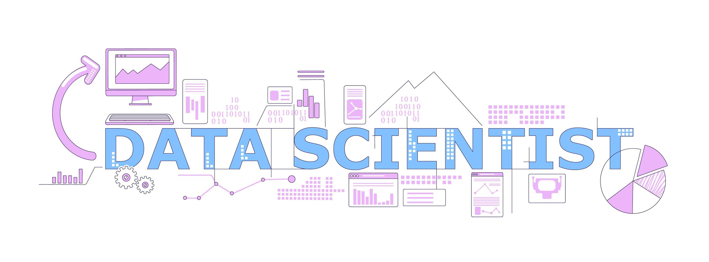

## I ❤️ Python

I am a passionate enthusiast of Python, deeply captivated by its versatility and the transformative role it plays in various fields such as ***mathematics***, ***machine learning***, ***data science***, ***artificial neural network***, ***data visualization***, ***finance***, and ***algorithmic trading***. 

Leveraging Python’s intuitive syntax and its vast ecosystem of libraries, I actively explore its applications in solving complex problems and modeling real-world scenarios.

With a profound appreciation for Python's adaptability and its extensive community-driven resources, I continuously strive to harness its potential to innovate and excel in these domains.

## ➗ [Applying Math with Python](https://github.com/yaser-rahmati-official/Applying-Math-with-Python)
* Foundational Mathematics Courses
* Calculus
* Linear Algebra
* Discrete Mathematics
* Differential Equations
* Statistics and Probability
* Advanced Mathematics
* Applied Mathematics

## 📡 [Electrical Engineering with Python](https://github.com/yaser-rahmati-official/Electrical-Engineering-with-Python)
* Circuit Analysis
* Electronics
* Power Systems
* Electromagnetics
* Control Systems
* Signal Processing

## 📊 [Data Science with Python](https://github.com/yaser-rahmati-official/Data-Science-with-Python)
* Machine Learning
* Deep Learning
* Natural Language Processing
* Computer Vision

## 💰 [Algorithmic Trading with Python](https://github.com/yaser-rahmati-official/Algorithmic-Trading-with-Python)
* Python and Statistics for Financial Analysis
* Machine Learning for Trading
* Technical Analysis for Algorithmic Trading
* Portfolio and Risk Management
* High-Frequency Trading in Python
* Crypto Trading Bots in Python
* Interactive Brokers Python API
* Building and testing strategies with Backtrader, PyAlgoTrade, and QuantLib

<!--
**yaser-rahmati-official/yaser-rahmati-official** is a ✨ _special_ ✨ repository because its `README.md` (this file) appears on your GitHub profile.

Here are some ideas to get you started:

- 🔭 I’m currently working on ...
- 🌱 I’m currently learning ...
- 👯 I’m looking to collaborate on ...
- 🤔 I’m looking for help with ...
- 💬 Ask me about ...
- 📫 How to reach me: ...
- 😄 Pronouns: ...
- ⚡ Fun fact: ...
-->

